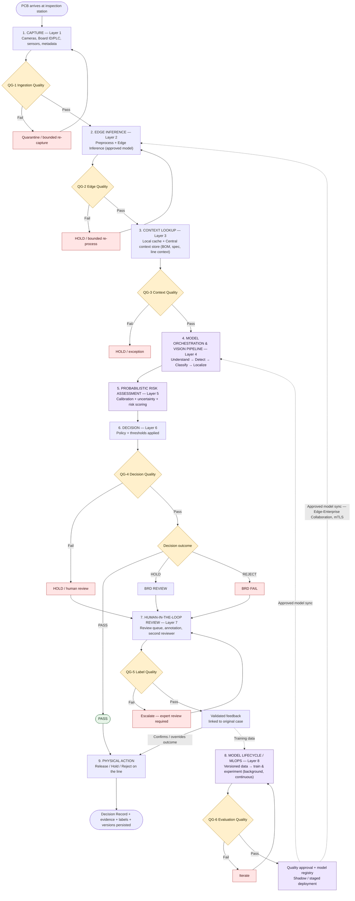

# AI-Native PCB Defect Inspection — End-to-End Workflow

Single-board journey through the reference architecture, from capture to final disposition.

**Source diagram:** `AI_NATIVE_SOLUTION_ARCHITECTURE_INFOGRAPHIC.png` — Enterprise AI-Native PCB Defect Inspection Architecture (Model-Driven | Probabilistic | Adaptive | Human in the Loop). Diagram status: *Proposed design — validation required.*

**Related documents:** `AI_NATIVE_USER_JOURNEYS_WORKFLOWS_GAPS.md` (per-actor journeys, per-layer workflows, and open process gaps for this same architecture). This file linearizes the same architecture into the single path one board actually takes.

**Version:** 1.0 | **Status:** Draft for stakeholder / BA validation

---

## 1. Step-by-Step Flow

```
START: PCB arrives at inspection station (Edge / Factory)
│
├─ 1. CAPTURE (Layer 1 — Data Capture & Ingestion)
│    Cameras + Board ID scanner/PLC + sensors + metadata capture image, board ID, machine state
│    → QG-1 Ingestion Quality check (image complete? focus/lighting OK? metadata present?
│      source healthy? sequence valid?)
│    ├─ FAIL → Quarantine invalid evidence OR bounded re-capture → retry Step 1
│    └─ PASS ↓
│
├─ 2. EDGE INFERENCE (Layer 2 — Edge AI Processing, on-site, low-latency)
│    Preprocess (denoise/normalize/crop) → Edge Inference (approved model)
│    → QG-2 Edge Quality check (model version approved? latency healthy? deadline met? output valid?)
│    ├─ FAIL → HOLD / bounded re-process → retry Step 2
│    └─ PASS → persist raw + processed image as trusted evidence ↓
│      (optional local PASS/FAIL decision only for pre-approved layers 5–6 products,
│       communicated to line adapter/PLC directly)
│
├─ 3. CONTEXT LOOKUP (Layer 3 — Context & Reference, Edge+Enterprise, shared)
│    Local cache checked first → synced against Central context store (BOM, spec/revision,
│    line/process context)
│    → QG-3 Context Quality check (product/revision valid? spec+component refs complete?
│      line context valid?)
│    ├─ FAIL → HOLD / exception (or fall back to last-known-good only within approved validity policy)
│    └─ PASS → validated context attached to the evidence ↓
│
├─ 4. MODEL ORCHESTRATION & VISION PIPELINE (Layer 4 — AI Model Layer)
│    Approved model routing (product-specific) → Understand → Detect → Classify → Localize
│    → specialized models (missing/wrong/misaligned component, solder bridge, damage, scratch, unknown)
│    → produces model evidence: classes, bounding boxes, raw per-class scores
│    (Central re-analysis may run here too, but preserves the original edge outcome — it doesn't
│     silently overwrite it) ↓
│
├─ 5. PROBABILISTIC RISK ASSESSMENT (Layer 5)
│    Evidence aggregation → validated calibration (temperature scaling/Platt/isotonic — raw scores
│    are NOT automatically probabilities) → uncertainty estimation (aleatoric/epistemic)
│    → risk assessment (severity, criticality, business impact) ↓
│
├─ 6. DECISION (Layer 6 — Decision Layer)
│    Product-specific rules/thresholds + approved decision logic applied to calibrated risk
│    → QG-4 Decision Quality check (valid evidence? complete context? policy/risk checks passed?)
│    ├─ FAIL → HOLD or human review
│    └─ PASS → outcome determined + Decision Record created (evidence, reasoning, model/policy
│         version, audit trail)
│         │
│         ├─ PASS ─────────────────────────────────────────────► Physical release (Step 9)
│         │
│         ├─ HOLD ──► BRD REVIEW (human/business reviewer) ──┐
│         │                                                   │
│         └─ REJECT ──► BRD FAIL (human/business reviewer) ──┤
│                                                              ▼
├─ 7. HUMAN-IN-THE-LOOP REVIEW (Layer 7 — only for HOLD/REJECT/uncertain/anomaly cases)
│    Item enters review queue → annotation + review (bounding boxes, component IDs, reason codes,
│    second reviewer where required)
│    → QG-5 Label Quality check (guideline agreement? label completeness? critical/safety checks?)
│    ├─ FAIL → Escalate (expert review required)
│    └─ PASS → validated feedback stored + linked to original case
│         │
│         ├──► feeds back into Step 6 outcome (confirms/overrides PASS/HOLD/REJECT →
│         │     physical action only now approved)
│         └──► feeds forward into Step 8 (training data for future models)
│
├─ 8. MODEL LIFECYCLE / MLOPS (Layer 8 — background, continuous, not per-board)
│    Versioned data (verified labels from Step 7, leakage-controlled) → train & experiment
│    → QG-6 Evaluation Quality check (independent recall/FN, calibration, regression, hardware
│      validation)
│    ├─ FAIL → Iterate
│    └─ PASS → quality approval + model registry → shadow/staged deployment (canary + monitoring,
│         rollback if needed)
│         └──► approved model synced back to Step 2 (Edge Inference) and Step 4 (Enterprise
│              orchestration) via secure Edge–Enterprise Collaboration channel (mTLS)
│
├─ 9. PHYSICAL ACTION (back at the Edge line)
│    Only after Decision Layer PASS, or BRD Review/BRD Fail approval on HOLD/REJECT
│    → board physically released, held, or rejected on the line
│
└─ END: Decision Record + all evidence, labels, and model/policy versions persisted for audit
     (Governance, Security & Compliance Layer — Layer 10 — captures immutable lineage
     end-to-end, throughout every step above)
```

### Cross-cutting, active throughout Steps 1–9 (not sequential steps)

| Layer | Role while the board is in flight |
|---|---|
| **Layer 9 — Observability & Ops** | Monitors every step for drift/anomalies/SLA breaches; can trigger Platform Owner intervention or suspend operation at any point. |
| **Layer 10 — Governance, Security & Compliance** | RBAC, encryption/retention, audit & lineage, and model/policy governance apply to every step's data and every approval. |
| **Layer 11 — Adaptive UI** | Operators/inspectors/managers view and act on any of the above (review queue, decision records, alerts) through a role-aware, AI-composed interface. The UI never executes an action itself — it only surfaces the explicit user action back into the workflow. |

### Two feedback loops close the system

1. **Quality loop:** Human review (Step 7) → validated labels → MLOps retraining (Step 8) → improved models synced back to Edge/Enterprise inference (Steps 2, 4).
2. **Reliability loop:** Observability (Layer 9) → incident response/forecasting → policy gate adjustments → feeds back into capacity and operational planning.

---

## 2. Mermaid Flowchart



---

*This document is derived solely from `AI_NATIVE_SOLUTION_ARCHITECTURE_INFOGRAPHIC.png`. It does not resolve the open questions logged in `AI_NATIVE_USER_JOURNEYS_WORKFLOWS_GAPS.md` (e.g., HOLD/Escalate SLA, retry bounds, physical actuation mechanism) — those remain pending BA/client validation.*
