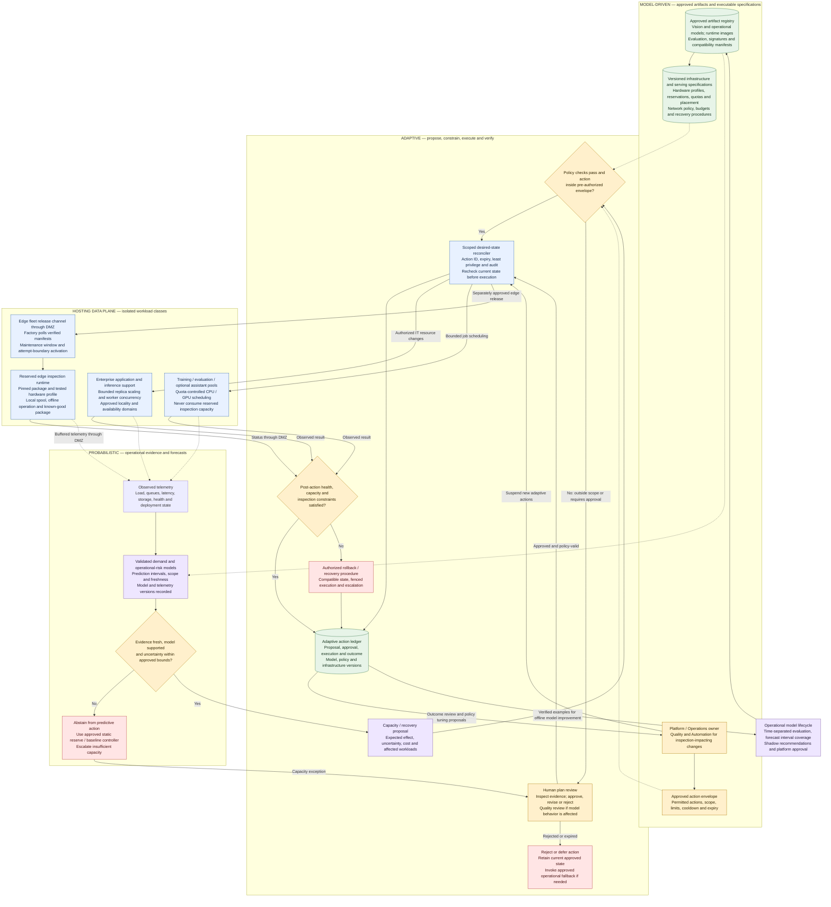

# AI Native solution architecture: Model-Driven, Probabilistic, Adaptive, Human in the Loop

AI-Based Automated Board Defect Inspection System | Proposed architecture | 9 September 2026

Based on [Business Requirements Document.docx](<Business Requirements Document.docx>), [Solution architecture.png](<Solution architecture.png>) and [AI_NATIVE_GAP_ANALYSIS.docx](AI_NATIVE_GAP_ANALYSIS.docx). The gap analysis supplies the proposed extensions; it does not convert BRD discovery questions into approved requirements.

This revision extends AI Native design from detection through hosting using four perspectives: **Model-Driven, Probabilistic, Adaptive, and Human in the Loop**. It contains five complementary Mermaid diagrams. Diagram 1 is the enterprise overview; diagrams 2–4 expand decision, learning and engineering; diagram 5 defines adaptive hosting and operations. Standalone `.mmd` files with the same code are provided in `architecture/`. Predictive hosting and bounded operational adaptation are proposed extensions requested in this revision, not requirements already approved in the BRD.

## 1. Architecture interpretation

“Probabilistic” describes estimated visual defect evidence and explicit uncertainty. Model scores become probability estimates only where calibration has been validated for the relevant operating scope. The model need not use stochastic inference at runtime. A fixed model can produce repeatable outputs while its predictions remain uncertain.

The target combines probabilistic perception with deterministic, approved business policy, durable workflows and human authority. Uncertainty methods, calibration, out-of-distribution detection and multi-view aggregation are proposed capabilities subject to feasibility and latency evaluation. They are not guarantees that every unknown defect will be recognized.

The full lifecycle is organized around versioned models, uncertainty-aware decisions, evidence-driven adaptation and accountable human control. This includes visual inspection, data selection, review prioritization, engineering, deployment, capacity planning and incident response. Storage transactions, authorization, interlocks and command delivery remain deterministic foundations of the AI Native system; introducing uncertainty into those guarantees would undermine the solution.

Angular/TypeScript, Java/Spring Boot, Python/ONNX Runtime, PostgreSQL, RabbitMQ and NGINX remain viable implementation choices. Hosting evolves from manually managed machines to a model-aware platform with immutable runtime artifacts, declarative infrastructure, resource isolation, predictive capacity planning, controlled reconciliation and fleet release management. Managed VMs or an approved container platform can implement these capabilities. Platform selection, CPU/GPU capacity and model families remain benchmark and operational decisions; AI Native is an end-to-end operating architecture rather than a vendor label.

### 1.1 Four architecture perspectives

| Perspective | Architectural meaning | Detection through hosting |
| --- | --- | --- |
| Model-Driven | Learned models and executable domain/deployment specifications are first-class, independently versioned artifacts. Distinguish statistical models from deterministic policy specifications. | Vision and image-quality models; uncertainty-aware review ranking; demand and failure-risk models; package registry; resource profiles; deployment and acceptance contracts. |
| Probabilistic | Predictions carry validated score semantics, uncertainty and supported operating scope. Decisions consider error costs and confidence in evidence. | Defect estimates, ambiguity and abstention; evaluation confidence bounds; workload prediction intervals; capacity-exhaustion risk and operational abstention. |
| Adaptive | Feedback changes candidate data, models, routing and resource plans through bounded, observable loops. | Active sampling, governed retraining, approved package selection, predictive central scaling, constrained job scheduling and measured recovery. |
| Human in the Loop | People define goals and permissible actions, adjudicate ambiguity, approve consequential changes and can suspend automation. | Inspectors review boards; Quality verifies labels and models; engineers review generated changes; platform owners approve action envelopes and exceptional hosting changes. |

### 1.2 End-to-end application of the four perspectives

| Layer | Model-Driven | Probabilistic | Adaptive | Human in the Loop |
| --- | --- | --- | --- | --- |
| Acquisition | Versioned capture recipe and validated image-quality model | Blur, occlusion or unfamiliar-image signals | Request recapture only within an approved timing/attempt budget | Automation approves capture settings and camera changes. |
| Detection | Approved model selected for board/revision and required views | Per-defect scores, validated calibration and ambiguity | Select among pre-approved packages before an attempt; improve candidates offline | Quality approves supported scope and release evidence. |
| QC and review | Executable severity/tolerance policy plus optional validated review-ranking model | Abstain where acceptance evidence is insufficient | Reprioritize review within severity/deadline constraints; never relax quality to drain queues | Inspectors decide disputed cases; Manufacturing owns physical routing. |
| Data and learning | Versioned datasets, labels, experiments and sampling policy | Representativeness, label disagreement and statistical uncertainty | Combine targeted sampling with representative PASS audits; generate retraining candidates | Quality adjudicates labels and accepts evaluation. |
| Application and integration | Versioned schemas and workflow specifications; model-linked evidence | Distinguish predicted defects from confirmed outcomes | Bounded worker scaling and review workload recommendations | Owners approve schema, workflow and integration changes. |
| Engineering and evaluation | AI-assisted tasks grounded in approved context and executable contracts | Generated output is a hypothesis until verified | Feedback improves task context, test coverage and candidate implementation | Engineers and QA independently review outputs and evidence. |
| Delivery and hosting | Immutable package, infrastructure specification and demand/risk model | Forecast intervals and risk estimates accompany capacity proposals | Bounded central scaling, scheduling and authorized rollback with cooldowns | Platform owners approve envelopes; Quality approves model-affecting changes. |
| Operations and recovery | Versioned anomaly models, dependency maps and runbooks | Incident hypotheses include uncertainty and supporting telemetry | Low-risk pre-authorized runbooks; otherwise escalate; verify the result | Operators can stop adaptation, approve exceptions and restore known-good operation. |

These are target capabilities with acceptance gates. Learned image-quality, ranking or operational models must earn deployment through evidence; deterministic baseline checks and static capacity reserves remain available when models are absent, stale or unreliable.

Legend: solid arrows show runtime requests, evidence or workflow transitions; dashed arrows show configuration, deployment, monitoring or supporting evidence. Purple nodes represent probabilistic processing or model lifecycle; orange nodes represent approved policy and human gates; red nodes represent exception handling; green nodes represent durable data. Arrows across the DMZ show logical payload direction, not permission for unsolicited inbound OT connections.

## 2. Enterprise architecture

```mermaid
flowchart TB
    subgraph BUSINESS["BUSINESS AND QUALITY AUTHORITY"]
        Owners["Quality / Manufacturing / Product<br/>Own scope, targets, fallback and acceptance"]
        Contracts["Versioned acceptance contracts<br/>Defect taxonomy, supported variants and views<br/>Quality limits, deadlines and review rules: TBD"]
        Owners --> Contracts
    end

    subgraph OT["FACTORY OT NETWORK - repeat per production line"]
        Camera["Industrial cameras and controlled lighting<br/>Versioned capture configuration"]
        Identity["Board identity / barcode / batch<br/>Board type and revision where available"]
        PLC["Optional PLC / line controller<br/>Position, interlocks and physical routing"]
        subgraph EDGE["INDUSTRIAL INSPECTION COMPUTER - local deadline boundary"]
            Capture["Camera SDK adapter<br/>Correlate trigger, board and required views"]
            Coordinator["Model-aware inspection coordinator<br/>Select approved package by board / revision<br/>Pin attempt, runtime profile and deadline"]
            InputGate["Input and scope validation<br/>Image quality, complete views and supported recipe"]
            Prep["Versioned preprocessing<br/>Geometry and image-coordinate mapping"]
            Vision["Probabilistic vision service - Python / ONNX Runtime<br/>Defect classes, locations and raw scores"]
            Uncertainty["Validated confidence and uncertainty processing<br/>Calibration where supported<br/>Ambiguity and unfamiliar-input signals"]
            Aggregate["Validated board evidence aggregation<br/>Multiple defects and correlated views<br/>Coverage and reason codes"]
            Policy["Deterministic QC policy<br/>Approved severity, tolerance and abstention rules<br/>PASS / FAIL / REVIEW"]
            Fallback["Invalid, unavailable or overdue inspection<br/>Approved manual inspection / hold / stop procedure"]
            Local[("Local PostgreSQL and durable image spool<br/>Evidence, predictions, dispositions and outbox")]
            Control["Line control adapter<br/>Command ID, expiry and board-state checks<br/>Acknowledgement and reconciliation"]
            Sync["Synchronization and polling worker<br/>Idempotency, retries, checksums and bounded storage"]
            Package["Approved immutable inspection package<br/>Model, preprocessing, calibration and recipe<br/>Compatibility manifest and previous approved version"]
            Installer["Release verifier and installer<br/>Authenticate manifest and verify compatibility<br/>Activate only at an attempt boundary"]
            ReviewFence["Human disposition validation<br/>Authority, record version, expiry and current board state"]
        end
        Camera --> Capture
        Identity --> Capture
        PLC -->|"Trigger and position if selected"| Capture
        Capture --> Coordinator
        Coordinator --> InputGate
        InputGate -->|"Usable and supported"| Prep
        InputGate -->|"Invalid or unsupported"| Fallback
        Prep --> Vision
        Vision -->|"Valid output within deadline"| Uncertainty
        Vision -->|"Failure or timeout"| Fallback
        Uncertainty --> Aggregate
        Aggregate --> Policy
        Policy -->|"Initial disposition and evidence"| Local
        Fallback -->|"Record failure when storage is available"| Local
        Fallback -->|"Independent approved operational procedure"| Owners
        Local -->|"Committed pending action"| Control
        Control -->|"Validated command if integrated"| PLC
        PLC -->|"Acknowledgement and observed state"| Control
        Control -->|"Delivery or reconciliation status"| Local
        Local --> Sync
        Sync -->|"Authorized disposition response"| ReviewFence
        ReviewFence -->|"Valid: append before action"| Local
        ReviewFence -->|"Stale or conflicting: escalate"| Fallback
        Sync -->|"Downloaded release"| Installer
        Installer -->|"Verified package"| Package
        Package -.-> Coordinator
        Package -.-> InputGate
        Package -.-> Prep
        Package -.-> Vision
        Package -.-> Uncertainty
        Package -.-> Aggregate
        Package -.-> Policy
    end

    subgraph DMZ["INDUSTRIAL DMZ - controlled OT / IT boundary"]
        Gateway["NGINX integration gateway<br/>Mutual TLS and allowlisted HTTPS<br/>Factory-initiated uploads and polling only"]
    end

    subgraph IT["ENTERPRISE IT - asynchronous application boundary"]
        Users["Operators / inspectors / managers / administrators"]
        IdP["Enterprise identity provider<br/>OIDC SSO and privileged-user MFA"]
        UI["Angular / TypeScript application<br/>Original images, overlays, review and history"]
        LB["NGINX reverse proxy / load balancer"]
        subgraph APP["SPRING BOOT MODULAR APPLICATION - replicated instances"]
            Ingest["Inspection ingestion API<br/>Schema, identity and idempotency checks<br/>Track evidence completeness"]
            Review["Human review and override module<br/>Assignment, reasons, concurrency and escalation"]
            Config["Configuration and release API<br/>Only approved manifests and authorized dispositions"]
            Reports["Authorized history and reporting API<br/>Verified versus predicted quality and data freshness"]
            Outbox["Transactional outbox publisher"]
        end
        MQ["RabbitMQ durable queues<br/>Retry and dead-letter handling"]
        Workers["Integration workers<br/>Idempotent delivery and controlled replay"]
        MES["Optional MES / quality system"]
        Notify["Alerts and reviewer escalation"]
        Users --> UI
        UI -.->|"Sign-in"| IdP
        IdP -.->|"Validated identity; backend role and line checks"| APP
        UI -->|"HTTPS"| LB
        LB --> Review
        LB --> Reports
        LB --> Config
        Outbox --> MQ
        MQ --> Workers
        Workers --> MES
        Workers --> Notify
    end

    subgraph DATA["PROTECTED DATA AND EVIDENCE PLATFORM"]
        DB[("PostgreSQL primary and standby<br/>Attempts, predictions, reviews, rules and outbox")]
        Objects[("S3-compatible object storage<br/>Images, annotations, datasets and artifacts")]
        Replica[("Reporting replica / views<br/>Visible freshness")]
        Audit[("Restricted append-only audit archive<br/>Actor, reason and version lineage")]
        Backup[("Encrypted database and object backups<br/>Retention, holds and tested recovery")]
    end

    subgraph LEARN["GOVERNED MODEL AND DATA LIFECYCLE - isolated from production"]
        Sample["Adaptive authorized sampling<br/>Uncertainty-ranked cases plus representative PASS audits<br/>Record selection probabilities and label budget"]
        Labels["Quality-owned labeling and adjudication<br/>Override is not automatically a training label"]
        Datasets["Versioned dataset manifests<br/>Grouped splits, provenance and leakage checks"]
        Experiments["Reproducible experiments<br/>Train and tune using training / validation splits"]
        Eval["Independent acceptance evaluation<br/>Per-defect and board metrics, uncertainty bounds<br/>Robustness, coverage and target-hardware latency"]
        Approval["Quality and release approval<br/>Scope, evidence and rollback criteria"]
        Registry["Immutable approved release registry<br/>Signed or authenticated compatible manifest"]
        Rollout["Controlled shadow and staged rollout<br/>Candidates cannot actuate<br/>Approved promotion and rollback"]
        Sample --> Labels
        Labels --> Datasets
        Datasets --> Experiments
        Experiments --> Eval
        Datasets -->|"Frozen independent test partition"| Eval
        Eval --> Approval
        Approval --> Registry
        Registry --> Rollout
    end

    subgraph ENGINEERING["AI NATIVE ENGINEERING - separate development authority"]
        Context["Versioned engineering context<br/>Requirements, schemas, fixtures and task constraints"]
        Assist["AI-assisted requirements, code and tests<br/>Scoped tools and approved data access"]
        Engineer["Engineer review and independent verification"]
        CI["Git / Jenkins evidence pipeline<br/>Build, scan, contract, integration and hardware tests"]
        Release["Authorized application and infrastructure release<br/>Immutable artifacts, declarative specifications<br/>Tests, resource profiles and recovery plan"]
        Context --> Assist
        Assist --> Engineer
        Engineer --> CI
        CI --> Release
    end

    subgraph HOSTING["AI NATIVE HOSTING - bounded adaptive platform"]
        Fleet["Model-aware fleet and serving manager<br/>Approved package / hardware compatibility<br/>Edge reservations and central worker pools"]
        Desired["Versioned desired-state repository<br/>Infrastructure, runtime images, quotas and placement<br/>Approved scaling and recovery envelopes"]
        Forecast["Validated operational prediction models<br/>Demand, saturation and failure-risk estimates<br/>Prediction intervals and freshness"]
        Planner["Adaptive capacity and recovery planner<br/>Candidate action, evidence and expected impact<br/>Abstain when uncertain or outside scope"]
        PlatformGate["Deterministic action-policy gate<br/>Budget, availability, isolation and cooldown checks<br/>Human approval outside authorized envelope"]
        PlatformOwner["Platform / Operations owner<br/>Approve plans and envelopes<br/>Suspend automation and review outcomes"]
        Reconcile["Scoped infrastructure reconciler<br/>Apply authorized desired state<br/>Audit, verify and roll back eligible changes"]
        Desired --> Fleet
        Forecast --> Planner --> PlatformGate
        PlatformGate -->|"Pre-authorized action"| Reconcile
        PlatformGate -->|"Exception or uncertainty"| PlatformOwner
        PlatformOwner -->|"Explicit scoped approval"| Reconcile
        Reconcile --> Desired
        Reconcile -->|"Observed deployment result"| PlatformOwner
    end

    subgraph OPS["CROSS-CUTTING OPERATIONS AND GOVERNANCE"]
        Telemetry["OpenTelemetry / Prometheus / Grafana<br/>Equipment, latency, commands, queues and storage<br/>Edge telemetry buffered through DMZ"]
        QualityMetrics["Verified quality and business monitoring<br/>Slice metrics, sampling coverage and label lag<br/>Review workload, drift signals and cost per board"]
        Triage["Accountable incident and drift triage<br/>Check equipment, data, model, rules and workflow"]
        Security["OT segmentation, least privilege and secrets<br/>Artifact authenticity and dataset protection"]
        Recovery["Tested fallback and recovery procedures<br/>Edge replacement, restore, failover and rollback"]
    end

    subgraph OPTIONAL["OPTIONAL P2 - quality investigation assistance"]
        Copilot["Evidence-grounded assistant<br/>Read-only tools, citations and abstention<br/>No disposition or production-control authority"]
        Retrieval["Permission-filtered retrieval<br/>Approved procedures and evidence APIs"]
        Copilot --> Retrieval
        Retrieval --> Reports
    end

    Sync -->|"Uploads and polls over HTTPS mTLS"| Gateway
    Gateway -->|"Inspection and evidence uploads"| Ingest
    Gateway -->|"Poll releases"| Config
    Gateway -->|"Poll review dispositions"| Review
    Gateway -->|"Responses to factory polls"| Sync
    Ingest --> DB
    Ingest --> Objects
    Review -->|"Append disposition and outbox atomically"| DB
    Review -->|"Authorized evidence reads"| Objects
    Config --> DB
    Config -->|"Approved artifacts"| Objects
    DB --> Outbox
    DB --> Replica
    Reports --> Replica
    Reports --> Objects
    Workers --> Audit
    DB --> Backup
    Objects --> Backup
    Objects -->|"Authorized evidence only"| Sample
    DB -->|"Review and sampling provenance"| Sample
    Registry -->|"Release artifacts"| Objects
    Rollout -->|"Approved activation scope"| Config
    Contracts -.-> Policy
    Contracts -.-> Eval
    Contracts -.-> Context
    CI -->|"Software and integration evidence"| Approval
    Release -.->|"Controlled IT deployment"| APP
    Release -.->|"Approved edge software via release channel"| Config
    Release -->|"Reviewed infrastructure specification"| Desired
    Registry -.->|"Approved manifests and resource profiles"| Fleet
    Fleet -->|"Edge assignments through existing polling path"| Config
    Fleet -.->|"Authorized IT runtime placement"| APP
    Fleet -.->|"Bounded asynchronous capacity"| Workers
    Contracts -.-> PlatformGate
    Telemetry --> Forecast
    QualityMetrics --> Planner
    Desired -.-> PlatformGate
    Reconcile -.->|"Outcome telemetry"| Telemetry
    Security -.-> Reconcile
    Gateway -.-> Telemetry
    APP -.-> Telemetry
    DB -.-> Telemetry
    MQ -.-> Telemetry
    Replica --> QualityMetrics
    Labels -->|"Verified ground truth"| QualityMetrics
    Telemetry --> Triage
    QualityMetrics --> Triage
    Triage -->|"Investigated improvement candidate"| Sample
    Triage -->|"Authorized recovery request"| Recovery
    Triage --> Notify
    Security -.-> Gateway
    Security -.-> ENGINEERING
    Security -.-> LEARN
    Recovery -.-> Backup
    Recovery -.-> Rollout
    UI -->|"Optional investigation request"| Copilot

    classDef ai fill:#eee6ff,stroke:#7954a1,color:#211a33;
    classDef policy fill:#fff0cc,stroke:#ad7600,color:#302400;
    classDef data fill:#e7f4e8,stroke:#39784a,color:#14321b;
    classDef service fill:#e8f1ff,stroke:#3267a8,color:#172b45;
    classDef risk fill:#ffe5e5,stroke:#b83e3e,color:#4a1515;
    classDef optional fill:#f4f4f4,stroke:#777777,color:#333333,stroke-dasharray:5 5;
    class Vision,Uncertainty,Aggregate,Experiments,Eval,Assist,Forecast,Planner ai;
    class Owners,Contracts,Policy,Approval,Engineer,ReviewFence,Package,Installer policy;
    class Local,DB,Objects,Replica,Audit,Backup,Datasets,Registry data;
    class Capture,Coordinator,InputGate,Prep,Control,Sync,Gateway,UI,LB,Ingest,Review,Config,Reports,Outbox,Workers,CI service;
    class Fallback,Triage,Recovery risk;
    class Copilot,Retrieval optional;
    class PlatformGate,PlatformOwner policy;
    class Desired data;
    class Fleet,Reconcile service;
```

Operational interpretation: local inspection can continue during a central outage only while approved equipment, configuration, evidence capacity and the agreed local review/fallback procedure remain available. If the edge itself or its durable storage fails, the independent Manufacturing-approved procedure must work without relying on the failed application. No browser, assistant or training service connects directly to the PLC.

## 3. Probabilistic inference and controlled decision flow

This view defines the ordering of checks. It deliberately avoids a fixed confidence threshold. A confirmed critical-defect rule takes precedence over uncertainty elsewhere in an otherwise valid inspection, subject to Quality approval. Invalid/incomplete inspections follow the approved exception procedure and cannot silently become PASS.

```mermaid
flowchart TD
    Start["Board trigger<br/>Create attempt ID and correlate available board identity"]
    Pin["Pin approved compatible release<br/>Model, transforms, calibration, aggregation and QC recipe"]
    Ready{"Equipment healthy, package approved,<br/>supported board and required views usable?"}
    Infer["Run versioned preprocessing and vision inference<br/>Return per-defect locations and raw scores"]
    Valid{"Output schema valid and result<br/>within the attempt deadline?"}
    Confidence["Apply validated score interpretation<br/>Calibrated estimates where supported<br/>Record model and calibration versions"]
    Uncertain["Assess validated ambiguity and novelty signals<br/>Image quality, model uncertainty and view disagreement"]
    Board["Aggregate evidence across required views<br/>Preserve correlated-view handling, multiple defects<br/>and inspected-region coverage"]
    Critical{"Approved critical-defect or<br/>mandatory rejection rule satisfied?"}
    Reject{"Other approved severity or<br/>tolerance rejection rule satisfied?"}
    Abstain{"Uncertain, unfamiliar, conflicting<br/>or insufficient acceptance evidence?"}
    Accept{"Complete inspection satisfies<br/>all approved acceptance conditions?"}
    Fail["FAIL<br/>Record rejected criteria and evidence"]
    Review["REVIEW<br/>Record abstention reasons and priority"]
    Pass["PASS<br/>Record acceptance evidence and coverage"]
    Invalid["UNAVAILABLE / INVALID processing status<br/>No automatic acceptance<br/>Approved manual / hold / stop procedure"]
    Persist["Persist original evidence, predictions and status<br/>Initial disposition, pinned release and audit<br/>Commit pending action in local outbox"]
    Durable{"Durable recording succeeded?"}
    Emergency["Independent operational fallback<br/>Storage or edge failure procedure<br/>Reconcile evidence when service is restored"]
    Action["Map disposition to approved physical action<br/>REVIEW is not itself a PLC action<br/>Validate board state, command ID and expiry"]
    Integrated{"Physical control integration selected?"}
    Dispatch["Dispatch command once logically<br/>Retries require idempotency and state reconciliation"]
    Ack{"Acknowledgement and observed state agree?"}
    Unknown["UNKNOWN delivery outcome<br/>Reconcile with controller and operator<br/>Never blindly repeat physical action"]
    Stored["Retain local evidence<br/>Upload through DMZ and verify central checksums"]
    Human["Authorized human review<br/>Original images, overlays, uncertainty and reason<br/>Staffed deadline and escalation"]
    Override["Append human decision with actor and reason<br/>Preserve original AI result and prior version"]
    Fence{"Disposition authorized, current<br/>and applicable to board location?"}
    Stale["Reject stale or conflicting action<br/>Retain audit and escalate"]
    Label["Separate label verification and adjudication<br/>Operational override alone is not ground truth"]

    Start --> Pin --> Ready
    Ready -->|"Yes"| Infer
    Ready -->|"No"| Invalid
    Infer --> Valid
    Valid -->|"No"| Invalid
    Valid -->|"Yes"| Confidence
    Confidence --> Uncertain --> Board --> Critical
    Critical -->|"Yes"| Fail
    Critical -->|"No"| Reject
    Reject -->|"Yes"| Fail
    Reject -->|"No"| Abstain
    Abstain -->|"Yes"| Review
    Abstain -->|"No"| Accept
    Accept -->|"Yes"| Pass
    Accept -->|"No"| Review
    Fail --> Persist
    Review --> Persist
    Pass --> Persist
    Invalid --> Persist
    Persist --> Durable
    Durable -->|"No"| Emergency
    Durable -->|"Yes"| Action
    Durable -->|"Yes: asynchronous sync"| Stored
    Action --> Integrated
    Integrated -->|"Yes"| Dispatch
    Integrated -->|"No: approved operator procedure"| Stored
    Dispatch --> Ack
    Ack -->|"Yes: persist acknowledgement"| Stored
    Ack -->|"No or timeout"| Unknown
    Unknown -->|"Approved escalation"| Emergency
    Stored -->|"Review required or authorized dispute"| Human
    Human -->|"Decision within workflow"| Override
    Human -->|"Overdue or service unavailable"| Emergency
    Override -->|"Return via factory polling"| Fence
    Fence -->|"Yes: append before dispatch"| Persist
    Fence -->|"No"| Stale
    Override -->|"Candidate annotation only"| Label

    classDef ai fill:#eee6ff,stroke:#7954a1,color:#211a33;
    classDef pass fill:#e7f4e8,stroke:#39784a,color:#14321b;
    classDef review fill:#fff0cc,stroke:#ad7600,color:#302400;
    classDef fail fill:#ffe5e5,stroke:#b83e3e,color:#4a1515;
    class Infer,Confidence,Uncertain,Board ai;
    class Pass,Stored pass;
    class Review,Human,Critical,Reject,Abstain,Accept,Fence review;
    class Fail,Invalid,Emergency,Unknown,Stale fail;
```

Decision semantics:

- Score calibration is assessed on held-out validation data and verified during independent acceptance. A defect detector score is not a board-level probability of acceptability.
- Multi-label defects need not form a mutually exclusive distribution. Do not force all defect probabilities to sum to one or multiply view-level probabilities under an unvalidated independence assumption.
- A board risk estimate is optional and requires its own ground truth, calibration and acceptance. Approved rule-based aggregation can meet the BRD without such an estimate.
- Review routing considers uncertainty, supported scope and evidence completeness. Low scores or no detections alone do not establish PASS.
- Measure automatic-decision coverage and review load alongside false positives, false negatives and critical recall. Statistical confidence intervals on evaluation metrics are different from runtime prediction confidence.
- Processing status, quality disposition and physical command status are separate fields. This prevents unavailable inference or unknown command delivery from masquerading as a valid quality result.
- A processed human command is deduplicated and does not re-open the same review or reissue an action through the diagram's persistence loop.

## 4. Governed data, learning and release architecture

Training/validation and acceptance partitions are separated before experimentation. Candidate shadow execution is authorized for observation only. Quality acceptance and production activation remain explicit gates.

```mermaid
flowchart TB
    Evidence[("Authorized production evidence<br/>PASS / FAIL / REVIEW and unavailable cases<br/>Camera settings, release IDs and downstream outcomes")]
    Sampling["Representative sampling policy<br/>Random PASS audits plus targeted difficult cases<br/>Record selection probability and sampling scope"]
    Annotate["Quality-owned annotation<br/>Defect taxonomy, regions, severity and label policy"]
    Adjudicate{"Verified label and permitted reuse?"}
    Quarantine["Quarantine disputed, corrupt or restricted samples<br/>Resolve disagreement or exclude with reason"]
    Version[("Immutable dataset manifest<br/>Image hashes, label versions and lineage<br/>Board, batch, time and line grouping keys")]
    Split["Group-aware split and leakage validation<br/>Related views and repeated boards remain together"]
    Train[("Training partition")]
    Validate[("Validation partition<br/>Model selection, thresholds and calibration")]
    Holdout[("Frozen independent acceptance partition<br/>Representative real images and slice counts")]
    Experiment["Reproducible model experiments<br/>Code, data, environment and hardware recorded<br/>Architecture choice based on feasibility"]
    Tune["Tune model, calibration and aggregation<br/>Approved cost and quality tradeoffs<br/>No tuning against the final acceptance partition"]
    Candidate[("Candidate inspection package<br/>Compatible model, runtime, transforms, calibration<br/>Taxonomy, capture constraints and QC recipe")]
    Test["Independent evaluation evidence<br/>Per-defect and board errors with uncertainty bounds<br/>Calibration, robustness, review rate and coverage<br/>Target-hardware end-to-end load and fault results"]
    Gate{"Approved acceptance contract met<br/>for every required scope and slice?"}
    Rework["Investigate failure and revise candidate or scope<br/>Refresh acceptance set when tuning contaminated it"]
    ShadowPermit["Authorize observation-only shadow trial<br/>Resource budget and isolated command path"]
    Shadow["Shadow on intended line<br/>Active approved package remains authoritative<br/>Collect independent ground truth"]
    ShadowGate{"Shadow evidence and operational<br/>readiness accepted by Quality?"}
    Approve["Quality approval and authorized release decision<br/>Record scope, evidence, approvers and rollback triggers"]
    Registry[("Immutable approved registry<br/>Authenticated manifest and artifact hashes<br/>Previous approved compatible release retained")]
    Stage["Controlled staged activation<br/>Factory polls through DMZ<br/>Verify compatibility and activate between attempts"]
    Monitor["Monitor service, verified quality and outcomes<br/>Per-line and variant slices, sample counts and label lag<br/>Drift signals and review capacity"]
    Triage{"Investigated unacceptable behavior<br/>under approved incident criteria?"}
    Continue["Continue approved operation<br/>Expand only after rollout gate acceptance"]
    Rollback["Authorized rollback or approved fallback<br/>Compatible prior release; reconcile in-flight attempts"]
    Improvement["Governed improvement backlog<br/>Equipment, data, rules, model or workflow hypothesis"]
    Policy["Quality-owned acceptance contracts<br/>Limits and statistical method: TBD<br/>FR / AI / AC traceability"]
    Software["Reviewed software and integration evidence<br/>Security, schema, durability and recovery checks"]

    Evidence --> Sampling --> Annotate --> Adjudicate
    Adjudicate -->|"No"| Quarantine
    Quarantine -->|"Resolved and authorized"| Annotate
    Adjudicate -->|"Yes"| Version
    Version --> Split
    Split --> Train
    Split --> Validate
    Split --> Holdout
    Train --> Experiment
    Experiment --> Tune
    Validate --> Tune
    Tune --> Candidate
    Candidate --> Test
    Holdout --> Test
    Software --> Test
    Policy -.-> Tune
    Policy -.-> Test
    Test --> Gate
    Gate -->|"No"| Rework
    Rework --> Experiment
    Rework -->|"Additional representative evidence needed"| Sampling
    Gate -->|"Yes"| ShadowPermit
    ShadowPermit --> Shadow --> ShadowGate
    ShadowGate -->|"No"| Rework
    ShadowGate -->|"Yes"| Approve
    Approve --> Registry --> Stage --> Monitor --> Triage
    Triage -->|"No"| Continue
    Continue --> Monitor
    Triage -->|"Yes"| Rollback
    Triage -->|"Confirmed improvement need"| Improvement
    Improvement --> Sampling
    Improvement -->|"Model hypothesis"| Experiment
    Monitor -->|"Sampled evidence, not automatic labels"| Evidence

    classDef data fill:#e7f4e8,stroke:#39784a,color:#14321b;
    classDef ai fill:#eee6ff,stroke:#7954a1,color:#211a33;
    classDef gate fill:#fff0cc,stroke:#ad7600,color:#302400;
    classDef risk fill:#ffe5e5,stroke:#b83e3e,color:#4a1515;
    class Evidence,Version,Train,Validate,Holdout,Candidate,Registry data;
    class Experiment,Tune,Test,Shadow ai;
    class Adjudicate,Gate,ShadowPermit,ShadowGate,Approve,Policy,Triage gate;
    class Quarantine,Rework,Rollback risk;
```

A drift alert is a reason to investigate, not proof that retraining is needed. Adaptation includes uncertainty-based sample acquisition, verified feedback, candidate retraining, calibrated threshold proposals and selection among pre-approved packages. Model selection occurs before an inspection attempt and cannot change the pinned package mid-attempt. Any camera, rule or model change follows the appropriate revalidation path. Production weights and acceptance thresholds are not modified by an unvalidated online feedback loop. Autonomous manufacturing-parameter modification remains outside the BRD scope.

The same lifecycle applies to learned hosting demand/risk models, using operational ground truth, time-separated evaluation, forecast calibration, shadow recommendations and Platform/Operations approval. Vision Quality approval and platform-model approval are distinct authorities. Hosting actions that alter inspection behavior or its validated hardware envelope also require Quality and Automation review.

## 5. AI Native engineering and optional assistance

AI assistance accelerates bounded engineering tasks. Existing review, reproducible builds and release authority remain. The optional runtime assistant has a separate, read-only evidence boundary.

```mermaid
flowchart LR
    subgraph DEV["DEVELOPMENT AND VALIDATION ENVIRONMENT"]
        Sources["Approved BRD decisions and architecture<br/>Schemas, fixtures, acceptance criteria, infrastructure and runbooks"]
        Context["Versioned engineering context pack<br/>Task scope, permitted tools and protected data policy"]
        Engineer["Engineer / BA / QA / ML practitioner<br/>Own task intent and expected behavior"]
        AI["AI engineering assistant<br/>Draft requirements, models, implementation, tests<br/>Infrastructure specifications and evidence summaries"]
        Sandbox["Scoped repository and test environment<br/>No production credentials or unrestricted data export"]
        Review["Human review of changes<br/>Independent expected results and threat analysis"]
        Git["Reviewed version-controlled change<br/>Code, configuration and context references"]
        CI["Reproducible CI and infrastructure evidence<br/>Build, scans, contracts, integration and deployment simulation<br/>Model evaluation and resource benchmarks when affected"]
        Gate{"Applicable acceptance evidence<br/>and release authorization complete?"}
        Release["Controlled artifact promotion<br/>Application release or governed model pipeline"]
        Metrics["Engineering outcome measures<br/>Accepted cycle time, review effort, rework<br/>Escaped defects and tool cost"]
        Sources --> Context
        Engineer --> Context
        Context --> AI
        AI --> Sandbox
        Sandbox --> Review
        Review -->|"Revision needed"| AI
        Review -->|"Accepted"| Git
        Git --> CI --> Gate
        Gate -->|"No: remediate"| Review
        Gate -->|"Yes"| Release
        Review --> Metrics
        CI --> Metrics
    end

    subgraph SUPPORT["OPTIONAL READ-ONLY QUALITY ASSISTANCE - enterprise IT"]
        User["Authenticated operator or quality analyst"]
        Auth["Backend user, role and line authorization"]
        Orchestrator["Bounded investigation assistant<br/>Question interpretation and approved read tools"]
        Tools["Permission-enforcing evidence and reporting APIs<br/>Validated queries calculate counts and trends"]
        Documents["Permission-filtered approved procedures<br/>Document identity, revision and freshness"]
        Model["Language model using authorized retrieved evidence<br/>Retrieved text treated as untrusted input"]
        Check["Answer and citation checks<br/>Evidence IDs, grounding and sensitive-data controls"]
        Answer["Evidence-linked explanation or explicit abstention<br/>User verifies operational relevance"]
        Evaluate["Assistant evaluation and monitoring<br/>Correct retrieval, access denial, grounding<br/>Injection resistance, latency and cost"]
        User --> Auth --> Orchestrator
        Orchestrator --> Tools
        Orchestrator --> Documents
        Tools --> Model
        Documents --> Model
        Model --> Check --> Answer
        Answer --> User
        Check -.-> Evaluate
    end

    Authority["Authority boundary<br/>Assistant output cannot override inspections,<br/>approve packages, change QC rules or command PLCs"]
    Release -->|"Authorized deployment process only"| Authority
    Answer -.->|"Advisory output only"| Authority

    classDef ai fill:#eee6ff,stroke:#7954a1,color:#211a33;
    classDef gate fill:#fff0cc,stroke:#ad7600,color:#302400;
    classDef optional fill:#f4f4f4,stroke:#777777,color:#333333,stroke-dasharray:5 5;
    class AI,Model ai;
    class Engineer,Review,Gate,Auth,Authority gate;
    class Orchestrator,Tools,Documents,Check,Answer,Evaluate optional;
```

The authority node is a constraint annotation, not a deployed service. Engineering releases follow the application or model approval process in diagrams 1 and 3 and the hosting process in diagram 5; the optional assistant cannot invoke that process. Ordinary evidence review remains available if generative assistance fails.

## 6. Inspection package and evidence contracts

| Contract | Minimum content |
| --- | --- |
| Approved package | Release ID; model hash; runtime/hardware compatibility; preprocessing/postprocessing; calibration and aggregation versions where used; taxonomy; QC recipe; capture constraints; supported board/revision/view matrix; schema compatibility; evaluation references; approval; rollback reference. |
| Inspection attempt | Unique attempt ID; board identity where available; reinspection parent; line/batch/variant; timestamps; required and received views; image hashes; pinned package; raw predictions; calibrated estimates where supported; uncertainty/coverage signals; processing status; initial disposition and reasons. |
| Human review | Actor/role; prior record version; original AI outcome; human disposition; reason; timestamp; command applicability; separate verified-label status. |
| Physical command | Stable command ID; attempt; approved action; expiry; expected board state; dispatch status; acknowledgement and reconciliation outcome. |
| Dataset and evaluation | Sample selection; image/label versions; provenance; grouped partitions; frozen test manifest; per-slice counts; metric definitions; statistical uncertainty; target-hardware results and acceptance evidence. |
| Hosting model | Model/version hash; telemetry schema; training period; independent time-separated evaluation; forecast horizon; interval coverage; validated workload scope; approval and expiry/revalidation policy. |
| Hosting desired state | Runtime image and package hashes; hardware/driver compatibility; resource reservations; placement; replica limits; data locality; budget; network policy; health gates; approved fallback and rollback. |
| Adaptive action | Action ID; model/version; observed state and freshness; predicted impact/interval; policy version; pre-authorization or named approval; expiry; affected workloads; execution status; post-action evidence and rollback outcome. |

Persist images durably before committing references. Track partial uploads and confirm checksums before considering central evidence complete. Use transactional outboxes and idempotent consumers for at-least-once delivery. Message deduplication alone cannot guarantee exactly-once physical actuation.

## 7. Source and gap traceability

| Architecture element | BRD coverage | Gap analysis coverage |
| --- | --- | --- |
| Capture, identity, supported scope and image validation | FR-001/002; sections 12, 18–21 | G02–G03, G07 |
| Probabilistic vision, localization and multi-defect evidence | FR-003/005/006/007/008; AI-001–AI-005 | G03–G06 |
| QC, abstention, review, override and fallback | FR-004/009/010; sections 23–24, 32; AC-007 | G06–G07, G11 |
| Durable evidence, integration, history and audit | FR-011/012; sections 25–29; AC-006 | G09, G14–G16 |
| Dataset lineage and independent evaluation | AI-001–AI-007; sections 17–19; AC-001–AC-003 | G04–G05, G08–G09 |
| Approved packages, shadow, staged release and rollback | AI-006/007; section 30; AC-008 | G09–G10 |
| Latency, offline operation, recovery and observability | Sections 21–23, 31; AC-004/005 | G07, G12, G16 |
| Verified feedback and quality monitoring | BO-08; sections 24, 30–31 | G08, G12, G17–G18 |
| AI-assisted engineering and executable acceptance | Proposed gap-analysis extension; supports AC-001–AC-008 | G13–G14, G17–G18 |
| Optional grounded investigation assistant | Separate enhancement beyond core FRs | G19; G20 authority exclusions retained |
| Business acceptance contracts | Sections 5, 13–17, 21–23, 39–41 | G01–G02, G06–G07, G18 |
| Model-aware hosting and predictive operations | User-requested extension supporting sections 21–23, 29–31; AC-004/005/008 | Extends G09–G10, G12–G18; operational-model acceptance is new design scope |

## 8. Decisions before production design approval

Quality must approve taxonomy, supported scope, metric definitions, per-defect limits, uncertainty/review policy, statistical acceptance and labeling authority. Manufacturing and Automation must approve throughput, the capture-to-action deadline, review/failure routing, equipment behavior and selected PLC/MES interfaces. Operations and Security must establish availability, offline duration, RTO/RPO, retention, network access and release permissions. Finance and Product must validate costs and benefits.

All numerical thresholds remain TBD. Calibration, uncertainty and unfamiliar-input methods must demonstrate value against their compute and review costs. The hosting platform must implement model-aware deployment, declared resource profiles, operational prediction, bounded adaptation and human oversight. Its substrate may be managed VMs or a container platform selected through benchmarking and operational review. A runtime LLM, vector database or cloud-dependent inspection path is not required to meet the four perspectives.

Production acceptance must exercise representative defects and variants, peak load, missing views, model/camera failure, central disconnection, full local storage, duplicate events, lost PLC acknowledgements, concurrent reviews, stale commands, restored evidence and compatible rollback. A diagram describes intended controls; passing evidence establishes readiness.

## 9. AI Native hosting and adaptive operations — diagram 5

Hosting is an active part of the model lifecycle. Each inference package declares a tested runtime and resource envelope. Operational models forecast demand and capacity risk; a planner proposes changes against quality, availability and cost objectives. A deterministic policy gate and scoped reconciler execute only authorized actions. Platform owners retain approval, suspension and recovery authority.

### 9.1 Hosting topology and runtime guarantees

- **Edge inference:** maintain local hardware reservations, preloaded approved artifacts, warm-up checks and version-pinned attempts. Central autoscaling cannot rescue a board whose physical deadline is local. Edge resource or runtime changes require target-hardware revalidation and a permitted activation boundary.
- **Enterprise serving:** deploy application, ingestion and worker capacity across the approved failure domains. Adaptive scaling operates within quotas and availability constraints, with rate limits and cooldowns to prevent oscillation. Measured service load can drive a baseline controller when the forecast model abstains.
- **Training and evaluation:** isolate compute, storage access and credentials from production. Schedule optional or interruptible jobs against approved budgets. Shadow candidates must fit a reserved shadow budget and cannot issue production commands.
- **Artifacts and infrastructure:** promote immutable runtime images and authenticated model packages together with declarative specifications. Validate driver/runtime compatibility, resource headroom, schema migration and recovery. Containerization is an implementation option; infrastructure specifications and reproducible deployment are required capabilities.
- **Outages:** the operational prediction service and central platform controller are outside the local inspection critical path. If they fail, freeze predictive changes, retain the approved desired state and use the baseline capacity/fallback procedure. The human suspension control stops new adaptive actions and reconciles in-flight actions without terminating a board attempt arbitrarily.

### 9.2 Adaptation and human authority matrix

| Action | Permitted automatic behavior after policy approval | Human decision boundary |
| --- | --- | --- |
| Sampling and review ranking | Select uncertain cases within budget while retaining representative audits and severity/deadline constraints | Quality approves sampling policy, ranking behavior and label acceptance. |
| Model selection | Route a new attempt to an already approved compatible package for its supported board/revision | New model, new scope, threshold or recipe requires Quality approval and evaluation. |
| Central capacity | Scale eligible application/worker replicas within approved quotas, locality and availability limits | New topology, network exposure, expanded spend or stateful storage changes require platform approval. |
| Training scheduling | Schedule authorized jobs within isolated CPU/GPU and spend budgets | New dataset use, larger budgets or resource-class changes require accountable approval. |
| Edge deployment | Distribute an already approved release and activate at its authorized boundary | Runtime/hardware envelope changes and production activation require the designated release approvals. |
| Recovery | Run explicitly pre-authorized low-risk procedures with health checks and bounded retries | Uncertain cause, stateful failover, destructive action or changed inspection behavior escalates. |
| Model improvement | Create and evaluate candidates using authorized verified data | Neither the vision model nor the operational model approves its own promotion. |

Automatic behavior here describes the proposed production system under a previously approved policy. It does not grant unrestricted authority to engineering assistants. Resource adaptation never changes defect severity, skips required views or relaxes acceptance thresholds to meet cost or throughput goals.

### 9.3 Evidence required to call hosting AI Native

| Perspective | Required demonstration |
| --- | --- |
| Model-Driven | Reconstruct a deployment from artifact, model, policy and infrastructure versions; reject an incompatible model/runtime profile. |
| Probabilistic | Evaluate operational forecasts on independent time periods; report interval coverage and demand errors against a baseline; abstain on stale or unsupported telemetry. |
| Adaptive | Replay representative load changes; demonstrate constrained scaling, cooldowns, quota denial, outcome verification and recovery without inspection deadline degradation. |
| Human in the Loop | Demonstrate plan approval/rejection, audit, suspension, exception escalation and Quality approval for inspection-affecting changes. |

Hosting acceptance also measures false operational alarms, action failure rate, recovery time, cost per inspected board and controller-induced instability. Targets remain stakeholder decisions. This extends AI Native accountability through the hosting layer while preserving the physical and quality constraints of the manufacturing solution.
