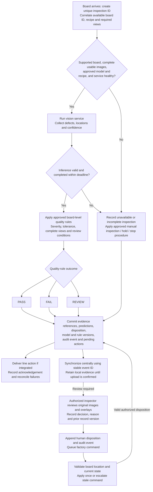

# Board Defect Inspection - Solution Architecture

Based on [Business Requirements Document.docx](<Business Requirements Document.docx>), discovery version 1.0, particularly sections 11-32 and 40-41.

This proposed architecture uses traditional software development technologies: Angular, Java/Spring Boot, REST APIs, PostgreSQL, RabbitMQ and managed Linux virtual machines. A dedicated computer-vision service fulfills the BRD's AI inspection requirements; generative AI and autonomous agents are not required. The model family and camera hardware remain subject to feasibility testing.

The BRD contains discovery questions and illustrative business rules. The technology choices and topology below are design proposals, not approved requirements. Throughput, latency, quality thresholds, retention and availability targets remain TBD.

## Enterprise architecture

Solid arrows represent runtime data flows. Dashed arrows represent identity, configuration, deployment or monitoring relationships. The local inspection path can continue during a central outage while approved configuration, equipment and local storage remain available.

```mermaid
flowchart TB
    subgraph USERS["Users"]
        Operator["Operator / Quality inspector"]
        Manager["Quality manager / Business analyst"]
        Admin["Quality approver / ML engineer / IT administrator"]
    end

    subgraph OT["Factory OT network - repeat per production line"]
        Camera["Industrial cameras and lighting"]
        Board["Board identity source<br/>Barcode, type, revision and batch"]
        PLC["PLC / Line controller - optional<br/>Physical routing and equipment interlocks"]
        subgraph EDGE["Industrial inspection computer"]
            Capture["Camera SDK adapter<br/>Capture, board correlation and image quality"]
            Coordinator["Java / Spring Boot inspection coordinator<br/>Required views, deadlines and inspection state"]
            Vision["Python / ONNX Runtime vision service<br/>Defect classes, locations and confidence"]
            Rules["QC decision module<br/>Versioned severity and tolerance rules<br/>PASS / FAIL / REVIEW"]
            Local[("Local PostgreSQL and image spool<br/>Results, evidence, commands and outbox")]
            Control["Line control adapter<br/>Command IDs, acknowledgements and reconciliation"]
            Sync["Synchronization worker<br/>Retry, deduplication and capacity limits"]
            Package["Approved model and recipe package<br/>Version, checksum and rollback copy"]
        end
    end

    subgraph DMZ["Industrial DMZ - controlled OT / IT boundary"]
        Gateway["NGINX integration gateway<br/>Allowlisted HTTPS endpoints and mutual TLS<br/>Factory-initiated uploads and command polling"]
    end

    subgraph IT["Enterprise IT application tier"]
        UI["Angular web application<br/>Evidence, review, history and dashboards"]
        LB["NGINX reverse proxy / Load balancer<br/>HTTPS and health checks"]
        SSO["Enterprise identity provider<br/>OIDC single sign-on and privileged-user MFA"]
        subgraph APP["Spring Boot modular application - replicated instances"]
            Ingest["Inspection ingestion API<br/>Validation and idempotent synchronization"]
            Review["Review and override module<br/>Assignment, authorization and concurrency checks"]
            Config["Configuration and governance module<br/>Defect catalogue, recipes and approved releases"]
            Reports["History and reporting module<br/>Quality trends and defect distribution"]
            Publisher["Transactional outbox publisher"]
        end
        MQ["RabbitMQ durable queues<br/>Retries and dead-letter queue"]
        Worker["Background integration workers<br/>Delivery status and controlled replay"]
        MES["Existing MES / Quality system - optional<br/>REST or agreed legacy interface"]
        Notify["Enterprise notification service<br/>Review escalations and operational alerts"]
    end

    subgraph DATA["Protected enterprise data tier"]
        DB[("PostgreSQL primary and standby<br/>Inspections, defects, reviews, rules and outbox")]
        Objects[("S3-compatible object storage<br/>Images, annotations and model artifacts")]
        Replica[("Reporting replica / Reporting views")]
        Audit[("Restricted append-only audit archive")]
        Backup[("Encrypted backup repository<br/>Database recovery and object backup")]
    end

    subgraph DELIVERY["Separate development and validation environment"]
        Curate["Quality-controlled dataset curation<br/>Verified labels and versioned datasets"]
        Train["Python model development and evaluation<br/>Independent test set and per-defect metrics"]
        Approve["Quality approval and artifact registry<br/>Compatible model, preprocessing and recipe"]
        CI["Git and Jenkins pipeline<br/>Build, test, scan, staged release and rollback"]
    end

    subgraph OPS["Operations and platform controls"]
        Monitor["OpenTelemetry, Prometheus and Grafana<br/>Health, latency, queues, storage and model quality"]
        Logs["Central logs and security monitoring"]
        Secrets["Enterprise secrets and certificate store"]
    end

    Operator --> UI
    Manager --> UI
    Admin --> UI
    UI -->|"HTTPS / REST"| LB
    UI -.->|"Sign-in"| SSO
    SSO -.->|"Validated identity and role claims"| APP
    LB --> Review
    LB --> Config
    LB --> Reports
    Camera --> Capture
    Board --> Capture
    PLC -->|"Trigger and position if integrated"| Capture
    Capture --> Coordinator
    Coordinator -->|"Local inference request"| Vision
    Vision -->|"Predictions or explicit failure"| Coordinator
    Coordinator --> Rules
    Package -.-> Vision
    Package -.-> Rules
    Rules -->|"Persist before dispatch"| Local
    Local -->|"Pending command"| Control
    Control -->|"Agreed industrial protocol"| PLC
    PLC -->|"Acknowledgement and state"| Control
    Control -->|"Delivery status"| Local
    Local --> Sync
    Sync -->|"Upload results and evidence; poll commands"| Gateway
    Gateway --> Ingest
    Gateway -->|"Poll approved releases"| Config
    Gateway -->|"Poll review dispositions"| Review
    Gateway -->|"Poll responses"| Sync
    Sync -->|"Verified installation"| Package
    Sync -->|"Authorized disposition; check current board state"| Coordinator
    Sync -->|"Synchronization checkpoints"| Local
    Ingest --> DB
    Ingest --> Objects
    Review --> DB
    Review -->|"Authorized evidence access"| Objects
    Config --> DB
    DB --> Publisher
    Publisher --> MQ
    MQ --> Worker
    Worker --> MES
    Worker --> Notify
    Worker --> Audit
    DB --> Replica
    Reports --> Replica
    Reports --> Objects
    DB --> Backup
    Objects --> Backup
    Objects -->|"Authorized retained samples"| Curate
    DB -->|"Verified reviews and provenance"| Curate
    Curate --> Train
    Train --> Approve
    Admin -.->|"Separate approval role"| Approve
    Approve --> Objects
    Approve -->|"Approved release manifest"| Config
    CI -.->|"Application releases"| APP
    CI -.->|"Controlled software releases"| EDGE
    EDGE -.->|"Telemetry through controlled gateway"| Monitor
    APP -.-> Monitor
    MQ -.-> Monitor
    DB -.-> Monitor
    Monitor --> Notify
    APP -.-> Logs
    Gateway -.-> Logs
    Secrets -.-> APP
    Secrets -.-> Gateway

    classDef physical fill:#fff1d6,stroke:#a66a00,color:#17202a;
    classDef service fill:#e8f1ff,stroke:#3267a8,color:#17202a;
    classDef data fill:#e8f5e9,stroke:#38804a,color:#17202a;
    classDef governance fill:#f0e9fa,stroke:#7954a1,color:#17202a;
    class Camera,Board,PLC physical;
    class Capture,Coordinator,Vision,Rules,Control,Sync,UI,LB,Ingest,Review,Config,Reports,Publisher,Worker service;
    class Local,DB,Objects,Replica,Audit,Backup data;
    class Gateway,SSO,Package,MQ,Curate,Train,Approve,CI,Monitor,Logs,Secrets governance;
```

## Inspection and human-review flow

REVIEW is an inspection disposition. Physical hold, manual inspection and stopping the line are separate operational actions that Manufacturing must approve before automatic control is enabled.

Low detector confidence alone does not establish that a board is acceptable. PASS requires the complete inspection to satisfy approved quality rules. Evaluate confidence thresholds against labelled data; raw scores are not validated business probabilities. This design does not assume the old diagram's 50%/85% thresholds or a fixed inspection latency.

## Technology and deployment

| Layer | Proposed technology | Responsibility |
| --- | --- | --- |
| User interface | Angular / TypeScript | Inspection evidence, overlays, review, administration and reports. |
| Business application | Java / Spring Boot modular application | REST APIs, explicit business rules, role checks and transactional workflows. |
| Local inspection | Java coordinator, camera SDK adapter, Python / ONNX Runtime | Hardware acquisition and dedicated computer vision; validate model export compatibility. |
| Data | PostgreSQL and S3-compatible object storage | Relational traceability and image/artifact persistence. |
| Background work | RabbitMQ and application workers | Durable integration and notification delivery outside the inspection deadline. |
| Access | NGINX, enterprise OIDC provider and TLS | User identity, service authentication and controlled network access. |
| Operations | OpenTelemetry, Prometheus, Grafana and central logs | Correlated application, infrastructure and inspection monitoring. |
| Delivery | Git, Jenkins and managed Linux VMs | Conventional build, test, deployment and rollback with separate environments. |

Deploy central application instances on at least two VMs behind a redundant load-balancer endpoint, subject to the agreed availability target. Use PostgreSQL primary/standby with monitored failover and replicated RabbitMQ queues across separate failure domains. Gateway and object-storage redundancy must match the same target. These are proposed controls, not a claim of a specific uptime guarantee.

Size each industrial inspection computer using representative camera workloads, including preprocessing and line-control latency. CPU versus GPU is a benchmark decision. Provide a tested standby or replacement procedure according to allowable downtime. Central outages can be buffered locally; an edge outage requires the approved production fallback. Scale by adding line-specific edge capacity and central application/worker instances. Kubernetes and cloud services are not prerequisites.

## Enterprise controls and failure handling

- **Traceability:** assign an inspection ID even without a board ID. Store available board identity, type/revision, batch, line, camera/view, timestamps, image hashes/references, defect predictions, confidence, model/preprocessing/rule versions, initial outcome, human decisions and control acknowledgements. Reinspection creates a linked attempt instead of overwriting history.
- **Delivery consistency:** commit each business change and its outbox event in one database transaction. Use at-least-once delivery, stable event IDs and idempotent consumers. Retry transient failures and expose dead-letter events for controlled replay. For physical commands, verify acknowledgement and current board state; message delivery alone cannot guarantee exactly-once actuation.
- **Evidence durability:** persist images locally before recording their references. Confirm central checksums before marking evidence complete. Track partial uploads and retain local copies until synchronization is acknowledged and retention permits deletion. Alert before the bounded spool fills; apply the approved fallback if durable recording becomes impossible.
- **Human review:** show original evidence, defect overlays and previous outcomes. Enforce role-based overrides, required reasons, optimistic concurrency checks, review deadlines and escalation. Preserve initial AI and authoritative human decisions. Central review outages require the agreed manual procedure.
- **Security:** authorize image access, history, overrides, configuration and deployments in the backend. Separate approval and deployment permissions. Encrypt data and backups at rest and traffic in transit; rotate service credentials and certificates. Restrict OT/IT communication to approved gateway routes; browsers cannot directly access databases or PLCs.
- **Audit and retention:** commit business audit events with state changes and archive through the outbox. Restrict update/delete permissions and use retention-locked storage where required. Define separate retention periods for images, results, datasets, models and audit records, including backup lifecycle and authorized deletion.
- **Recovery:** monitor replication and failover, back up databases and objects, and rehearse restoration of linked results and evidence. Manufacturing/IT must define recovery time and recovery point objectives. Reports display replica freshness; review writes use the authoritative primary.
- **Monitoring:** measure end-to-end latency, throughput, camera and inference failures, command acknowledgement errors, queue age, review backlog, local capacity and synchronization lag. Calculate precision, recall and false-positive/negative rates from verified ground truth; prediction-rate changes alone only trigger investigation.
- **Model governance:** verify corrections before training, version datasets, and prevent related board/image leakage into independent tests. Validate per-defect and board-level metrics, calibration where applicable, and target-hardware latency. Require Quality approval, staged deployment, integrity checks and rollback of a compatible model/preprocessing/recipe package. Monitoring does not automatically authorize retraining deployment.

## BRD traceability

| Requirement | Architecture coverage |
| --- | --- |
| FR-001, FR-002 | Camera acquisition, board correlation and inspection identity. |
| FR-003, FR-005 through FR-008 | Defect detection, classification, localization, confidence and multiple detections. |
| FR-004; proposed BR-001 and BR-002 | Versioned PASS/FAIL/REVIEW rules, severity and uncertainty handling. |
| FR-009, FR-010; proposed BR-003 | Authorized review/override, decision history and controlled disposition delivery. |
| FR-011, FR-012; sections 26-28 | Evidence retention, history, reporting and audit archive. |
| AI-001 through AI-005, AI-007 | Independent model evaluation, per-defect acceptance and approved confidence handling. |
| AI-006; proposed BR-004 | Approved model packages, per-inspection version, deployment history and rollback. |
| Sections 21-23 and 31 | Local deadline-sensitive processing, buffering, monitoring and approved fallback. |
| Section 25 | Optional PLC/MES/quality adapters with confirmed contracts. |
| Sections 29-30 | Access controls, network segmentation and governed model lifecycle. |
| AC-001 through AC-008 | Detection, critical recall, false positives, throughput, latency, traceability, review and approved-model acceptance checks. |

## Decisions required before detailed design

| Decision | Owner | Impact |
| --- | --- | --- |
| Board variants, views, inspection points and defect taxonomy | Manufacturing / Quality | Camera setup, recipes and training scope. |
| Per-defect recall, false-positive/negative limits and review thresholds | Quality | Model feasibility, quality rules and release acceptance. |
| Peak boards/minute and end-to-end decision deadline | Manufacturing / Automation | Edge sizing, capture timing and line-control handshake. |
| Failure action, REVIEW handling and override process | Manufacturing / Quality | Physical hold/manual inspection/stop behavior and escalation. |
| Board identity and PLC/MES/quality interfaces | Automation / IT | Protocols, correlation and acknowledgement semantics. |
| Availability, recovery objectives and maximum offline duration | Manufacturing / IT | Redundancy, local storage and recovery procedures. |
| Image/result/audit retention and access restrictions | Quality / Compliance / Security | Storage, archival, deletion and evidence protection. |
| Labelled data, ground-truth ownership and model approval | Quality / Data / ML team | Feasibility, independent evaluation and governed releases. |

Production acceptance must exercise representative images and board variants, peak load, camera/inference failures, lost PLC acknowledgements, central disconnection, storage exhaustion, duplicate events, concurrent overrides, backup restoration and model rollback. Numeric targets remain TBD until the BRD discovery decisions are resolved.
