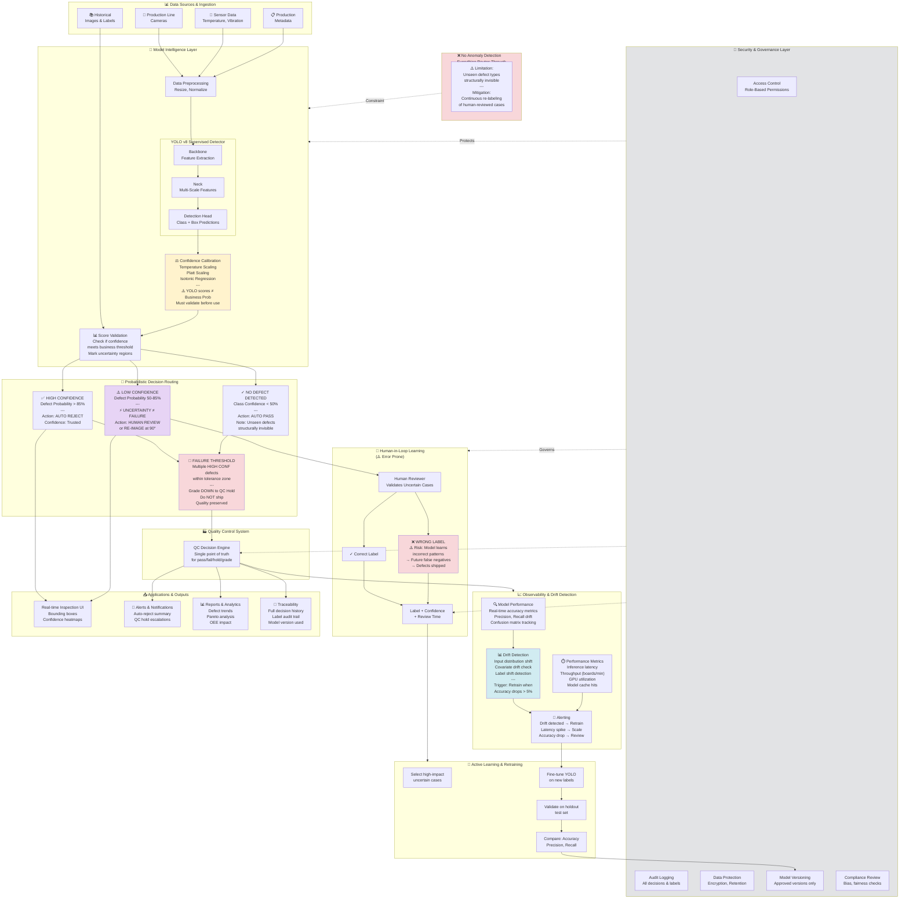

# Solution Architecture - Mermaid Diagram

## AI-Native Manufacturing QC with Calibrated Probabilistic Decisions

## Key Architectural Principles

### 1. **Confidence Calibration is Critical**
- Raw YOLO scores are model confidence, not business probability
- Requires temperature scaling, Platt scaling, or isotonic regression
- Must be validated against labeled test sets before deployment
- Recalibrate when new defect types are introduced

### 2. **Uncertainty ≠ Failure**
- **High Confidence (>85%)**: Auto-reject with trust
- **Low Confidence (50-85%)**: Escalate to human or re-image
- **No Defect (<50%)**: Auto-pass (but note: unseen types invisible)
- Graceful degradation preserves quality

### 3. **No Anomaly Detection Branch**
- Everything is a supervised classification problem
- **Structural Limitation**: Unseen defect types are invisible
- **Mitigation**: Continuously re-label human-reviewed cases to expand training set
- Consider periodic manual "expert sweeps" to catch new defect patterns

### 4. **Quality Grading (Not Binary Fail)**
- Failure Threshold = multiple defects within tolerance
- Grade DOWN to QC Hold (preserve quality)
- Do NOT ship; do NOT fail entire production
- Balances cost vs. quality tradeoff

### 5. **Human Review Has Risk**
- Humans make labeling mistakes
- Wrong labels teach the model incorrect patterns
- **Risk**: Future false negatives (defects shipped)
- **Mitigation**: 
  - Double-blind review for uncertain cases
  - Random spot-check of human labels
  - Track reviewer accuracy over time
  - Flag reviewers with high error rates

### 6. **Security & Governance Across Layers**
- **Access Control**: Role-based permissions (inspectors, QC engineers, data scientists)
- **Audit Logging**: All model decisions, labels, and changes
- **Model Versioning**: Only approved versions deployed
- **Compliance**: Bias detection, fairness validation
- **Data Protection**: Encryption, retention policies

### 7. **Drift Detection is Essential**
- Monitor real-time accuracy metrics
- Detect input distribution shift (covariate drift)
- Detect label shift (defect rates changing)
- **Trigger**: Auto-retrain when accuracy drops >5%

### 8. **Performance Monitoring**
- Inference latency (must stay <100ms per board)
- Throughput (boards/min matching production speed)
- GPU utilization and model cache efficiency
- Alert on bottlenecks

### 9. **Continuous Feedback Loop**
- Collect human labels from review queue
- Use active learning to select high-impact cases
- Retrain on curated dataset
- Validate against holdout set before deployment
- Version control models (approved versions only)

## Deployment Checklist

✅ Confidence calibration validated on production-like data  
✅ Failure threshold set with business stakeholders  
✅ Human reviewer error rates measured & tracked  
✅ Security governance policies documented & enforced  
✅ Drift detection thresholds calibrated  
✅ Audit logging enabled for compliance  
✅ Fallback procedures for model failures  
✅ Feedback loop integrated into QC workflow  
✅ Performance baselines established  
✅ Regular anomaly/new defect type detection (manual sweeps)
